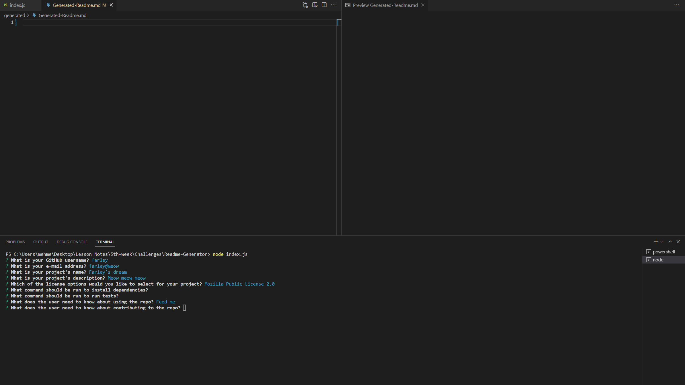
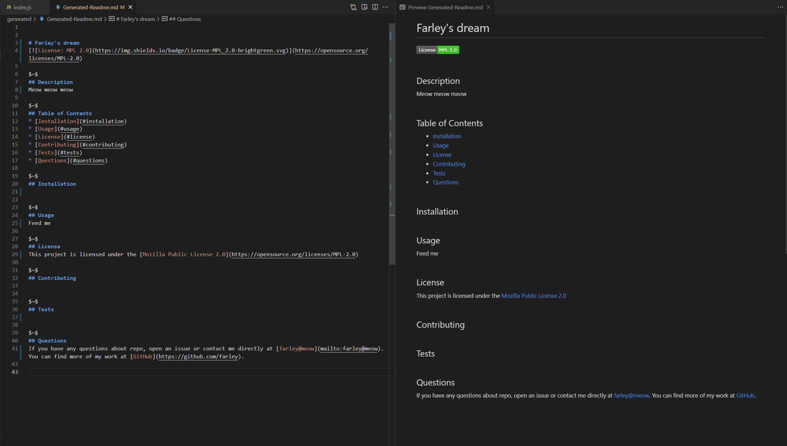

# Readme Generator


## Table of Contents
* [Description](#description)
* [Usage](#usage)
* [Usage Demonstration Link](#usage-demonstration-link)
* [User Story](#user-story)
* [Screenshots](#screenshots)
* [Code Snippet](#code-snippet)
* [Technologies Used](#technologies-used)
* [Credits](#credits)
* [Author Links](#author-links)


## Description

Readme Generator is a node.js application that runs on the console and generates a professionally styled "readme.md" file for the user based on the console inputs they provide. The application has been deployed to the drive at [Google Drive](https://drive.google.com/file/d/1JLpQM6ABCH3OW0PvaAJlU7fZmuf2PNWd/view).


## Usage

User starts the application by running "node index.js" in their console. Once the application starts, the user is prompted with a set of questions about the specific project they want to generate this "readme.md" file for. Questions prompted by the application includes the user's contact info, project title, description, licenses used, and usage/testing commands for the project. When user provides their answers using console input, "readme.me" file is generated with the user's answers and a table of contents.

## Usage Demonstration Link
Link to the video that demonstrates the usage of this application can be found at [here](https://drive.google.com/file/d/1JLpQM6ABCH3OW0PvaAJlU7fZmuf2PNWd/view).

## User Story

| As a         | I want                  | So that   
| ------------ | ----------------------- | ------------    |
| `Developer`  | a README generator      | `I can quickly create a professional README for a new project` |


## Screenshots

### *1. Console section*


### *2. Console response in Generated-Readme file*



## Code Snippet

### The main init function:
#### Prompts user to answer questions and based on the answers generates readme.md
```

function init() {
    inquirer
        .prompt(questions)
        .then((userInputs) => {
            console.log(userInputs);
            writeToFile('generated/Generated-Readme.md', userInputs);
        });
}

```

### The license rendering function:
#### Based on the license options selected by user returns the license section written to readme.md
```

function renderLicenseSection(licenseInput) {
  let link = renderLicenseLink(licenseInput);
  let licenseSelection = "";
 
  if(licenseInput === "None"){
    licenseSelection = "This project has no license!";
  }
  else{
    licenseSelection = `This project is licensed under the [${licenseInput}](${link})`;
  }

  return licenseSelection;
}

```

## Technologies Used

- JavaScript
- Node.js
- Npm Inquirer
- Screencastify


## Credits
[Npm Inquirer Documentation](https://www.npmjs.com/package/inquirer/v/8.2.4#methods)


## Author Links

[LinkedIn Profile](https://www.linkedin.com/in/mehmet-musabeyoglu)
<br/>
[GitHub Profile](https://github.com/MehmetMusabeyoglu)
<br/>
[E-mail Address](mailto:mehmetmusabeyoglu@gmail.com) 

 ## License 
 This project is licensed under the MIT License 
 <br>
 [](https://opensource.org/licenses/MIT)
